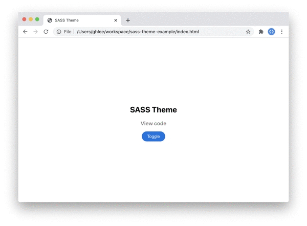

<div align="center">

  

  # Theme for SASS

</div>



## Source

```html
<body>
    <div id="app">
      <div>
        <h2>SASS Theme</h2>
        <a href="https://github.com/leegeunhyeok/sass-theme-example">View code</a>
        <button id="toggle">Toggle</button>
      </div>
    </div>
  </body>
```

```scss
// index.scss
@import 'theme';

html, body {
  width: 100%;
  height: 100%;
  padding: 0;
  margin: 0;
}

body {
  font-family: "-apple-system", "BlinkMacSystemFont","Apple SD Gothic Neo",
  "Inter", "Spoqa Han Sans", "Segoe UI",
  "Apple Color Emoji", "Segoe UI Emoji", "Segoe UI Symbol", Sans-Serif;
  -webkit-font-smoothing: antialiased;
  -moz-osx-font-smoothing: grayscale;
}

@include theme {
  #app {
    display: flex;
    width: 100%;
    height: 100%;
    background-color: t('background');
    justify-content: center;
    align-items: center;
    -webkit-transition: .3s;
            transition: .3s;
  
    div {
      text-align: center;
  
      h2 {
        color: t('textPrimary');
      }
  
      h4 {
        color: t('textSecondary');
      }
  
      button {
        cursor: pointer;
        outline: none;
        border: none;
        border-radius: 1rem;
        padding: .5rem 1rem;
        color: t('accentText');
        background-color: t('accent');
  
        &:hover {
          background-color: darken(t('accent'), 15%);
        }
      }
    }
  }
}
```

```scss
// theme.scss
$accent: #0071E3;
$accent-text: #fff;

$default-theme: 'light';
$theme: (
  light: (
    background: #fff,
    textPrimary: #000,
    textSecondary: #888,
    accent: #0071E3,
    accentText: #fff
  ),
  dark: (
    background: #131218,
    textPrimary: #fff,
    textSecondary: #888,
    accent: #0071E3,
    accentText: #fff
  )
);

@mixin theme {
  @each $theme-name, $palette in $theme {
    // Temp theme map
    $map-theme: () !global;

    @each $key, $color in $palette {
      $map-theme: map-merge($map-theme, ($key: $color)) !global;
    }

    // Default theme (body tag without class)
    @if $theme-name == $default-theme {
      body {
        @content;
      }
    }

    body.#{$theme-name} {
      @content;
    }

    // Clear map
    $map-theme: null !global;
  }
}

// Get color value from temp map
@function t($key) {
  @return map-get($map-theme, $key);
}
```
